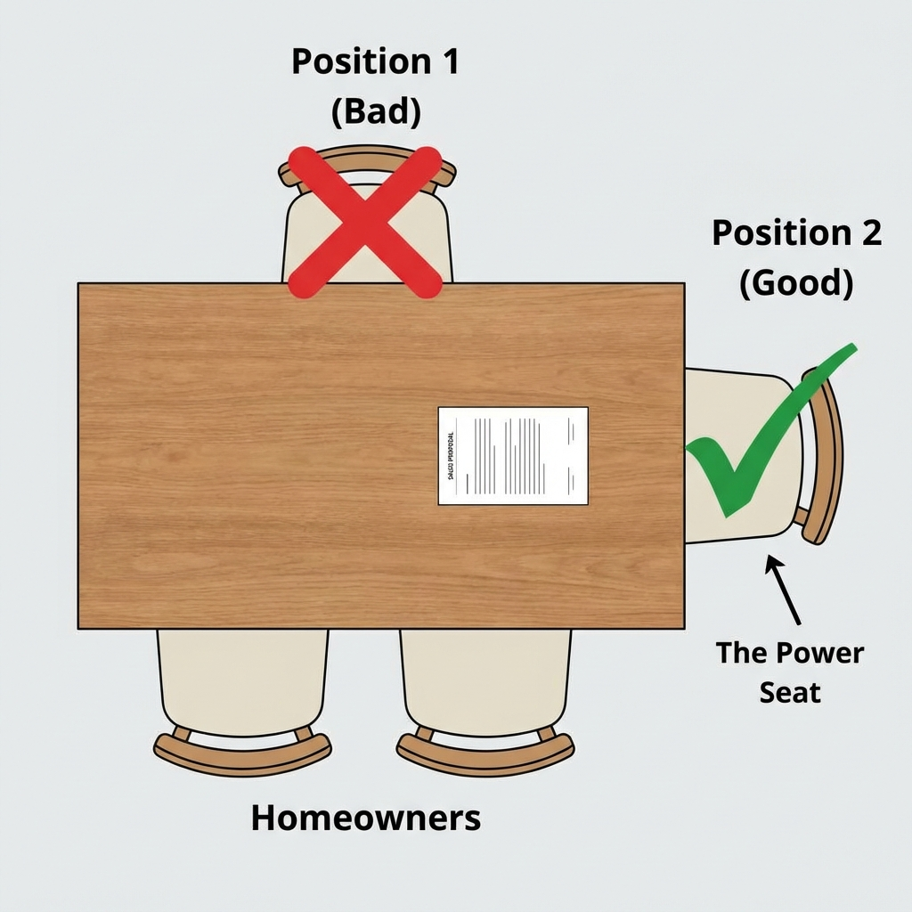

# Module 10: In-Home Presentation Mastery

## 🎥 Avatar Intro Script
**(Scene: A warm, inviting living room or kitchen table setting. Avatar is sitting comfortably.)**

"Welcome to the Kitchen Table. This is where champions are made. Module 10 is about 'In-Home Presentation Mastery'. When you are in someone's home, your body language, your tone, and even where you sit matters. I'll teach you 'The Power Seat' strategy to ensure you're working *with* the homeowners, not against them. We'll also cover how to use physical props to make the intangible tangible. Let's get comfortable."

*"People don't buy from companies. They buy from people they like and trust sitting in their kitchen."*

## 1. Setting the Stage: The Power Seat

Never sit across from the homeowners (Confrontational).
*   **The Goal**: Sit *next* to them or at a 90-degree angle.
*   **Why**: You want to look at the proposal *together*, side-by-side. You are an advisor, not an adversary.
*   **The TV Rule**: Turn it off. "Do you mind if we mute that so I don't miss anything you say?"

## 2. Physical Props & Showmanship

 Solar is invisible. Make it real.
*   **The Bill**: Have them physically hand you the bill. Circle the rising rates in RED ink.
*   **The Roof Image**: Print out their roof design. Put it in their hands. Ownership begins when they hold it.

## 3. The Slide Deck Strategy

*   **Slide 1-3**: Rapport & Credibility (Who we are, local projects).
*   **Slide 4-6**: The Problem (Utility Monopoly, Renting Power).
*   **Slide 7-9**: The Solution (Ownership, Net Metering).
*   **Slide 10**: The Proposal (The Math).

---

*(Diagram: Rectangular table. 'X' across from owners (Bad). 'Checkmark' next to owners (Good/Collaborative))*
