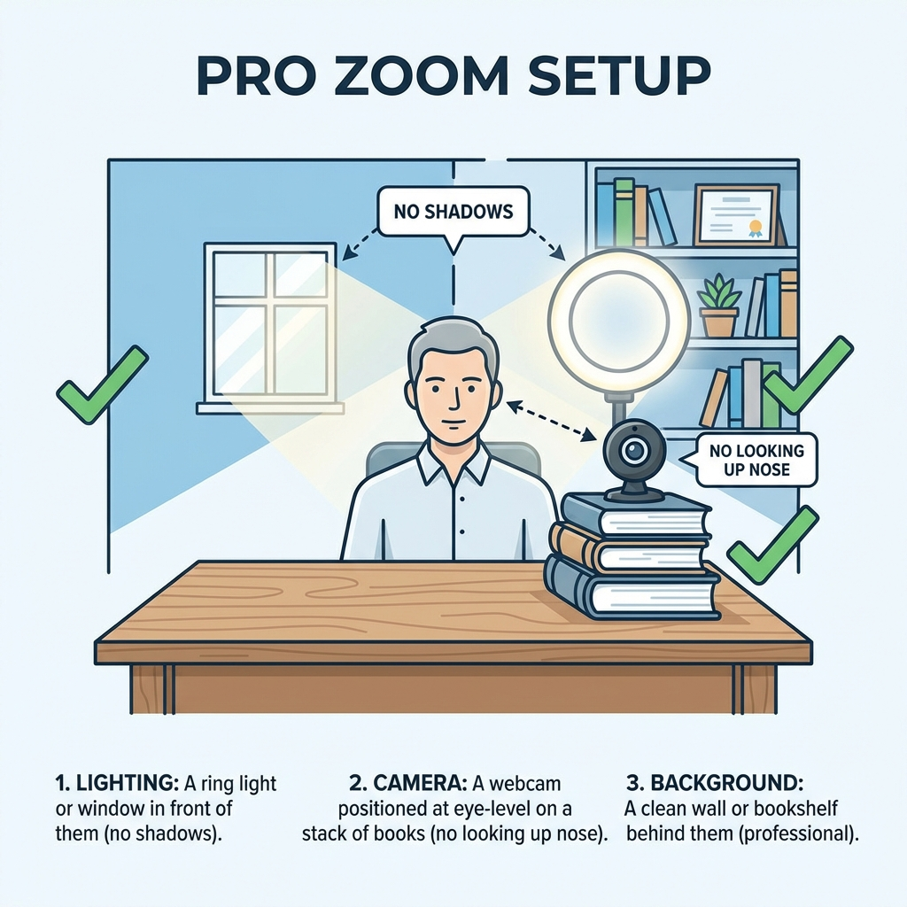

# Module 11: Virtual & Phone Sales Mastery

## 🎥 Avatar Intro Script
**(Scene: Modern home office with a ring light and laptop. Avatar is wearing headphones.)**

"The world has changed. If you can sell over Zoom, your territory is no longer just your neighborhood—it's the entire state. Module 11 is about 'Virtual Sales Mastery'. Selling through a screen is harder because you lose the physical connection. I'll teach you the 'Digital Handshake', how to use your voice to keep them engaged, and the exact setup you need so you look like a pro, not a hostage in a dark room."

*"On Zoom, your energy must be 20% higher than in person to break through the screen."*

## 1. The Zoom Setup (Don't Look Like an Amateur)

*   **Lighting**: Face a window or use a ring light. No shadows on your face.
*   **Camera**: Eye level. Use a stack of books if you have to. Don't let them look up your nose.
*   **Background**: Clean, professional, or a branded virtual background. No unmade beds!

## 2. The Digital Handshake

*   **Start with Video ON**: "Hey Mr. Jones! Great to see you. Can you see/hear me okay?"
*   **The Wave**: A physical wave breaks the ice and shows you are real.
*   **Eye Contact**: Look at the *camera*, not the screen, when you are talking.

## 3. Screen Sharing Etiquette

*   **Clean Desktop**: Close your 50 tabs. Turn off notifications.
*   **Use the Mouse as a Laser Pointer**: Don't just talk; point. "Do you see this number right here?" (Circle it with mouse).
*   **Check-Ins**: "Are you seeing the graph with the blue bars?" (Wait for Yes).

---

*(Infographic: Camera at Eye Level, Light in Front, Clean Background)*
