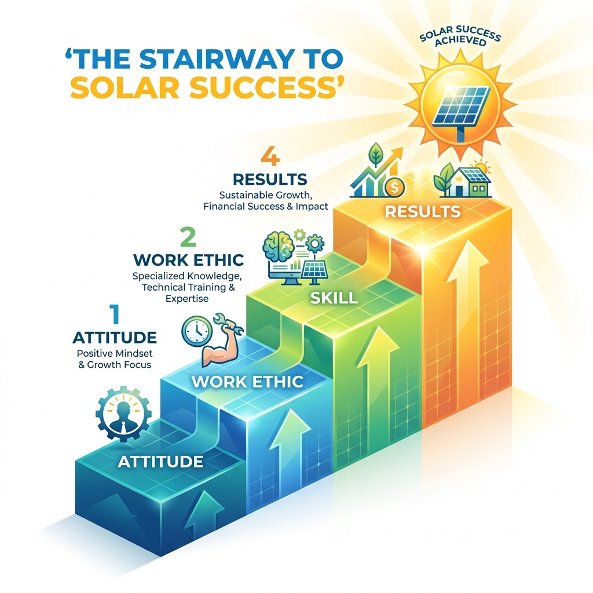

# Module 1: The Solar Mindset

## 🎥 Avatar Intro Script
**(Scene: Professional, warm, well-lit virtual office background. Avatar is friendly and confident.)**

"Welcome to Module 1. Before we talk about watts or kilowatts, we need to talk about *you*. Success in solar isn't just about what you know; it's about who you are. In this module, we're going to build your 'Solar Mindset'. We'll cover how to handle rejection not as a failure, but as a stepping stone. We'll also set the goals that will drive you every single day. Let's get your foundation right."

*"You can have everything in life you want if you will just help enough other people get what they want."*

## 1. The Foundation of Solar Success

Success in solar sales isn't just about scripts or closing techniques; it's about **Who You Are**. Your attitude determines your altitude.

### The Solar Professional's Creed
1.  **Integrity First**: I will never sell a system that doesn't benefit the homeowner.
2.  **Service Mindset**: I am here to serve, not to take. My commission is a byproduct of the value I create.
3.  **Belief**: I believe in the power of solar to change lives and the planet. My conviction is contagious.

## 2. Reframing Rejection

In solar, you will hear "No" more often than "Yes". This is not personal. Reframing is the key to resilience.

| The Old Thought | The Solar Professional's Reframe |
| :--- | :--- |
| "They rejected me." | "They just rejected the offer *for now*. I haven't found their 'Why' yet." |
| "I'm annoying them." | "I have a solution that can save them thousands. I have an obligation to share it." |
| "This is too hard." | "This is building my character. Every 'No' brings me closer to a 'Yes'." |

> **Tip**: Treat every "No" as a stepping stone. A "No" is simply a request for more information or a sign that trust hasn't been established yet.

## 3. Goal Setting: Validating Your "Why"

It is essential to have a target to hit. 

### The 7-Step Goal Setting Formula
1.  **Identify the Goal**: (e.g., "Install 10kW of Solar this month")
2.  **List the Benefits**: (e.g., "$3,000 commission, helping 5 families go green")
3.  **List the Obstacles**: (e.g., "Fear of knocking, lack of product knowledge")
4.  **List the Skills Required**: (e.g., "Mastering the door approach, understanding net metering")
5.  **Identify People/Groups to Help**: (e.g., "Sales Manager, Installation Team")
6.  **Develop a Plan**: (e.g., "Knock 50 doors/day, Roleplay 30 mins/day")
7.  **Set a Deadline**: (e.g., "By the 30th of the month")

## 4. Attitude is Everything

Your prospects mirror your energy. If you are dull, they are bored. If you are enthusiastic, they become interested.

*   **Check-Up from the Neck Up**: Before you knock on a door or dial a number, check your attitude. Are you excited?
*   **Automobile University**: Turn your car into a learning center. Listen to sales training (like this!) instead of the radio.

---

## 5. Deep Dive: The History of the Grid (AC vs DC)

To truly be an expert consultant, you must understand the machine you are replacing. The electrical grid as we know it is over 100 years old, born from the **"War of Currents"** between Thomas Edison (DC) and Nikola Tesla/George Westinghouse (AC).

### The Battle
*   **DC (Direct Current):** Edison's preferred method. It flows in one direction (like a battery). It is safe and efficient for devices but couldn't travel long distances without massive power plants on every corner.
*   **AC (Alternating Current):** Tesla's solution. It pushes and pulls electrons back and forth. It can be stepped up to massive voltages to travel hundreds of miles, then stepped down for your home. **AC won** because it allowed centralized power plants.

### Why It Matters Today
Solar panels produce **DC power** (just like your phone, laptop, and LEDs use). The Grid provides **AC power**.
*   **The Inverter's Job:** Your inverter is the bridge between the future (DC) and the past (AC Grid).
*   **Efficiency:** Every time we convert power, we lose some as heat. Modern solar is about **distributed generation**—making the power right where it's used (DC) rather than shipping it 500 miles (AC). You aren't just selling panels; you are upgrading their home from a 19th-century centralized model to a 21st-century decentralized power plant.

---

## 6. Deep Dive: Roof Anatomy 101

You aren't a roofer, but you are putting glass on one. Speaking the language builds massive trust.

### Key Terms
1.  **Rafters vs Trusses**:
    *   *Rafters*: The wooden beams that frame the roof. We drill into these (or the blocking between them) to anchor the system.
    *   *Trusses*: Engineered structure webs. Harder to mount to in some cases, often require specific lag bolts.
2.  **Azimuth**: The compass direction the roof faces (in degrees).
    *   *180° (South)*: The "Gold Standard" for North America. Maximum sun.
    *   *90° (East) / 270° (West)*: Still viable, but produces ~80-85% of specific yield compared to South.
3.  **Pitch**: The steepness of the roof.
    *   *Low Pitch (10-20°)*: Easier to walk on, catches late summer sun well.
    *   *Steep Pitch (30-45°)*: Harder install, great for shedding snow and catching winter sun.
4.  **Flashing**: The most critical component for preventing leaks. It's the metal sheet we slide under the shingles to seal the penetration point. **Never say "sealant" alone; always say "flashing".**

---

## 7. War Story: The $50k System That Got Denied

**The Situation:**
I was a rookie. I knocked on a door in a wealthy neighborhood—big house, three Teslas in the driveway. The homeowner, "Mr. Smith", was eager. He wanted 40 panels, 3 Powerwalls, the works. A $50,000 commission check was dancing in my head.

**The Mistake:**
I got "Happy Ears". I heard "Yes" and stopped checking boxes.
*   I didn't check the varying roof planes (too chopped up for 40 panels).
*   I didn't check the Main Service Panel (only 100 Amps, needed 200 Amps).
*   Worst of all, I didn't verify the title. The house was in a trust that required three signatures, and one trustee was in Europe.

**The Result:**
We signed the contract. I spent 3 weeks dragging this through engineering.
*   *Engineering*: "Roof only fits 20 panels." (Mr. Smith was mad).
*   *Electrical*: "Needs a $3,500 MPU (Main Panel Upgrade)." (Mr. Smith was madder).
*   *Finance*: "We need the signature from the trustee in France." (Deal killer).

The deal died. I wasted 30 hours of work and lost $0.

**The Lesson:**
**Qualify, Qualify, Qualify.** The bigger the deal, the harder you look for the "No". A fast "No" is the second best thing to a "Yes". Never skip the Site Survey basics just because you see dollar signs.

---

*(Image showing steps: Attitude -> Work Ethic -> Skill -> Results)*
