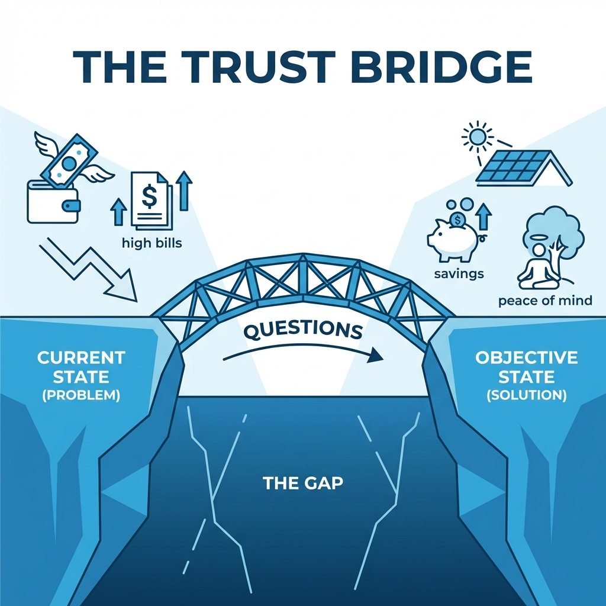

# Module 2: The Art of Connection

## 🎥 Avatar Intro Script
**(Scene: Casual but professional setting. Avatar leans in slightly, speaking in a lower, more conversational tone.)**

"Stop selling. Seriously. The moment you sound like a salesperson, you lose. In Module 2, we're going to learn the 'Art of Connection'. We'll use techniques like Advanced Problem Finding to lower your prospect's resistance. You're going to learn how to be a 'Problem Finder', not a product pusher. Let's learn how to build that bridge of trust."

*"The moment you start acting like a salesperson, resistance goes up. The goal is to act like a Problem Finder."*

## 1. Dropping the Sales Persona

Traditional selling tells you to be excited and pitch early. Modern sales psychology tells us to be calm, curious, and skeptical.

### The "Anti-Sales" Approach
Instead of: * "Hi! I'm [Name] with [Solar Company], and we're saving your neighbors money!"* (Triggers: Salesman Alarm)

Try: * "Hi... I'm just looking for [Name of Owner]? ... Oh, you're the owner? Okay, I wasn't sure if I had the right house... (Pause). I was just stopping by because..."*

## 2. The Bridge of Trust

You must build a bridge from **Where they are now** (Current State) to **Where they could be** (Objective State). The gap is the Problem.

### Phase 1: Connection Questions
Goal: Lower resistance and get them talking about their situation.
*   "I'm not even sure if we can help you yet, but..."
*   "How long have you lived in the home?"

### Phase 2: Problem Awareness Questions
Goal: Get them to realize they have a problem (High bills, uncertainty).
*   "Do you feel like your utility rates are staying the same, or are they creeping up on you?"
*   "What do you think happens if you *don't* do anything about that?"

## 3. Solution Awareness

Once *they* admit the problem, *they* want the solution.

*   "So, if there was a way to lock in a lower rate and own your power instead of renting it... would you be open to looking at that? Or are you happy with the utility company?"

## 4. Consequence Questions

*   "What happens in 5 years if the rates keep going up 10% a year and you're still renting power?"

---

## 5. Deep Dive: Body Language Library

Communication is 7% words, 38% tonality, and 55% body language. If your body says "Salesman" but your words say "Consultant," they won't trust you.

### Stance & Proximity
*   **The "Square Up" (Bad)**: Facing them directly shoulders-to-shoulders. This signals confrontation/aggression.
*   **The "Side-Angle" (Good)**: Standing at a 45-degree angle. This opens up the space and signals "I'm just passing by," reducing threat levels.
*   **The Step Back**: Immediately after knocking or ringing, take *two big steps back*. Standing right at the door triggers their "Intruder Alert" instinct.

### Micro-Expressions
*   **The Eyebrow Flash**: A quick raising of eyebrows signals recognition and friendliness. Use this when they first open the door.
*   **Palms Up**: Showing open palms signals "I have no weapons" (evolutionary biology) and honesty. Hiding hands in pockets triggers suspicion.

---

## 6. Deep Dive: The "Door Hanger" Strategy

Sometimes they just aren't home. A naked door is a missed opportunity. But most door hangers go straight to the trash.

### The "Note" Technique
Don't use glossy, printed marketing flyers. Use a "Sorry I Missed You" sticky note or a plain card that looks handwritten.
*   **The Look**: Yellow post-it note or heavy matte cardstock. Blue ink.
*   **The Script**: "Hi [Name if known], stopping by about the power usage in the neighborhood. Sorry I missed you. - [Your Name]"
*   **Why It Works**: It looks personal, like a neighbor left it, not a corporation. They *will* read it.

### The Callback
When you leave a note, mark it in your territory map. When you return:
*   "Hi, I'm the one who left the note the other day..."
*   This converts a "Cold" knock into a "Warm" follow-up.

---

## 7. Deep Dive: Cold Calling Scripts (5 Hooks)

If you can't knock (weather/dark), you dial. Here are 5 openers to break the ice.

**1. The "Mystery" Hook**
"Hi [Name], this is [Your Name], possibly a shot in the dark here... but did you still own the property at [Address]?"
*(They answer Yes)*
"Okay, perfect. I wasn't sure. The reason for the call is..."

**2. The "Neighbor" Hook**
"Hi [Name], I'm the guy who was working with [Neighbor Name] down the street yesterday. I tried to catch you at the door but I guess I missed you?"

**3. The "Permit" Hook**
"Hi [Name], calling because of the new net-metering permits that just got approved for the [Neighborhood Name] area. Has anyone dropped off the update packet for you yet?"

**4. The "Confusion" Hook**
"Hi [Name]? ... Yeah, sorry, I'm a little confused, looking at this utility map... are you guys currently on the tiered rate plan or the Time-of-Use plan with [Utility Co]?"

**5. The "Feedback" Hook (Referrals)**
"Hi [Name], we just finished an install for [Friend]. He mentioned you might be dealing with the same high summer bills he was?"

---

*(Diagram: Current State (Sad/High Bills) --[Bridge of Questions]--> Objective State (Happy/Solar Savings))*
