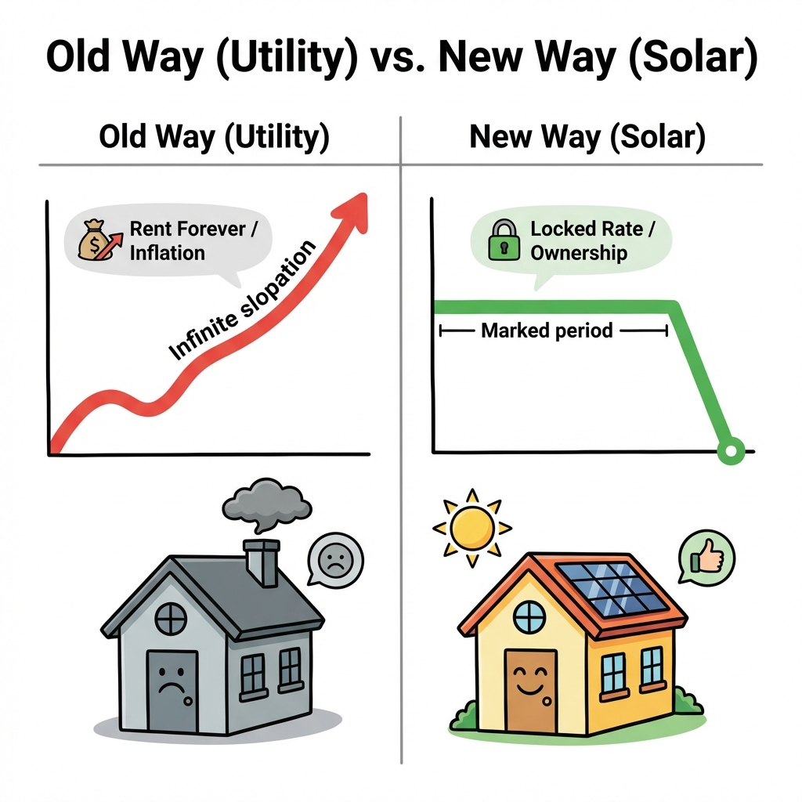

# Module 3: The Perfect Presentation

## 🎥 Avatar Intro Script
**(Scene: Standing next to a whiteboard or screen. High energy, authoritative but accessible.)**

"You've made the connection. Now, how do you present the solution? Module 3 is about 'The Perfect Presentation'. We're not just selling panels; we're selling freedom from the utility monopoly. I'll show you how to explain the 'Bill Swap' so simply that even a child would understand it. We'll stack the value so high that the price becomes irrelevant. Let's dive in."

*"Don't sell the panel. Sell the freedom from the utility company."*

## 1. Education vs. Selling

The modern homeowner doesn't want to be sold; they want to be educated. Your job is to make the complex simple.

### The "Bill Swap" Explanation
Most people think they are *buying* electricity. They are actually *renting* it at an unpredictable rate.

*   **The Script**: "Mr. Jones, right now you're renting your power from the utility company. It's like renting a home—you pay every month, the price goes up, and you never own it. Solar is simply swapping that rental payment for a mortgage payment on your own power plant. Once it's paid off, your electricity is free."

## 2. The Net Metering Analogy

Explaining how the grid acts as a battery is crucial.

*   **The "Rollover Minutes" Analogy**: "Remember old cell phone plans with rollover minutes? Solar is similar. During the day, you make more power than you need. The extra credits 'roll over' to the night time so you can use them when the sun is down. You're just banking miles for later."

## 3. The Value Stack (Why Now?)

Price is only an issue in the absence of value. You must stack the value so high that the price seems insignificant.

1.  **Fixed Cost**: Protection from inflation.
2.  **Home Value**: Increase in property value (Zillow says ~4%).
3.  **Tax Incentives**: The 30% coupon from the government.
4.  **Ownership**: An asset vs. a liability.

---

## 4. Deep Dive: Utility Bill Autopsy

You cannot save them money if you don't know where they are losing it. You must be able to read a bill better than the utility reps.

### The 3 Hidden Killers
Most people look at the "Amount Due". You need to look at:
1.  **Tiered Rates / Baseline Allowance**:
    *   Show them that the first bucket of power is cheap, but the "Tier 2" and "Tier 3" power is 30-40% more expensive.
    *   *Script*: "See this line? You're being penalized for using 'too much' power. Solar wipes out this expensive Tier 2 power first."
2.  **Delivery/Transmission Fees**:
    *   Often 50% of the bill is just *shipping* the power.
    *   *Script*: "You're paying as much for the delivery truck as you are for the pizza. Solar cuts out the truck."
3.  **NBCs (Non-Bypassable Charges)**:
    *   There is always a small fee (~$10-20) that cannot be erased (grid maintenance). Be honest about this.
    *   *Trust Builder*: "There is no such thing as a $0 bill. You will still pay ~$10/mo to stay connected to the grid. Any rep who says $0 is lying."

---

## 5. Deep Dive: Inflation Math (Napkin Close)

People are bad at exponential math. They think a $200 bill stays $200. You need to show them the "Cost of Doing Nothing."

### The Rule of 72
At 6% inflation (typical utility average), prices **double every 12 years**.

### The Napkin Math Script
(Draw this out for them)
1.  **Current Bill**: $250/mo.
2.  **Year 10 Bill (Estimate)**: $450/mo.
3.  **Year 20 Bill (Estimate)**: $800/mo.
4.  **Total Payments (30 Years)**: ~$140,000+ paid to the utility with **$0 ROI**.

**The Solar Contrast**:
1.  **Solar Payment**: $220/mo (Fixed).
2.  **Year 10 Payment**: $220/mo.
3.  **Year 20 Payment**: $220/mo.
4.  **Total Cost**: ~$60,000.
5.  **Savings**: **$80,000 kept in their pocket.**

*Ask*: "Would you rather pay $140k to rent your power, or $60k to own it?"

---

*(Chart comparing Utility (Rising curve, Infinite payments) vs Solar (Flat line, End date))*
