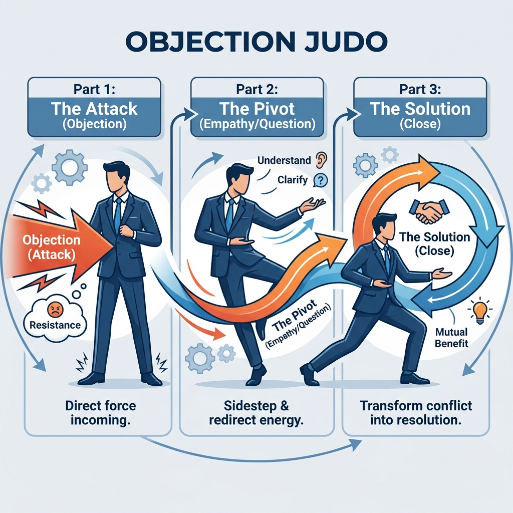

# Module 4: Mastering Objections

## 🎥 Avatar Intro Script
**(Scene: Professional studio. Avatar looks understanding and calm.)**

"What happens when they say 'No'? Do you panic? In Module 4, we're Mastering Objections. Using proven techniques, we'll learn that a 'No' is just a request for more information. I'll teach you the 'Porcupine' technique and how to use 'Feel-Felt-Found' to turn skeptics into believers. Let's turn those objections into opportunities."

*"Resistance is not a stop sign. It's a signpost saying 'Help me understand'."*

## 1. The Psychology of "No"

An objection is a defense mechanism. Do not fight it. Align with it.

### The "Porcupine" Technique
When a prospect asks a question, answer with a question to uncover the real concern.
*   **Prospect**: "Does this come with a battery?"
*   **You (Porcupine)**: "Are you looking for backup power when the grid goes down?"
    *   *Why?* If you just said "Yes", the conversation ends. By asking, you open a new door.

## 2. Feel - Felt - Found

The classic empathy bridge. It validates their feelings without agreeing with their wrong conclusion.

*   **Objection**: "It costs too much."
*   **Response**:
    *   **Feel**: "I understand exactly how you **feel**."
    *   **Felt**: "Many of my best customers **felt** the same way when they first looked at the total number."
    *   **Found**: "But what they **found** was that by swapping their bill, they actually started saving money from Day 1, with zero money out of pocket."

## 3. Creating the Cycle of Agreement

Get them saying "Yes" to small things, so it's easier to say "Yes" to the big thing.

*   "You want to lower your bills, right?" (Yes)
*   "You don't like rate hikes, correct?" (Yes)
*   "If we could freeze your rate, that would be good, wouldn't it?" (Yes)

---

## 4. Deep Dive: The "Feel-Felt-Found" Archive

Here are scripts for the top 5 solar objections. Memorize these.

**1. "We are going to wait."**
*   **Feel**: "I totally understand wanting to wait."
*   **Felt**: "John down the street **felt** that way last year because he thought prices might drop."
*   **Found**: "But what he **found** was that interest rates went up 2 points and the utility raised rates 8%. Waiting actually cost him about $4,000 in lost savings. Let's lock in today's rate."

**2. "I heard solar creates a lien on my home."**
*   **Feel**: "I know that word sounds scary."
*   **Felt**: "My own aunt **felt** nervous about that too."
*   **Found**: "What she **found** was that it's actually a UCC-1 fixture filing, not a lien. It just says the solar panels belong to the finance company, not the house. It doesn't stop you from selling or refinancing."

**3. "I might sell the house soon."**
*   **Feel**: "That's a valid concern."
*   **Felt**: "Lots of military families I work with **felt** hesitant because they move every 3 years."
*   **Found**: "What they **found** is that solar actually increases the home value by about 4.1% (according to Zillow). You're effectively renovating the home for $0 down to sell it for more."

**4. "It looks ugly."**
*   **Feel**: "I get that, aesthetics are important."
*   **Felt**: "My customer Sarah **felt** the same; she didn't want the blue waffle-looking panels."
*   **Found**: "What she **found** was that our new all-black 'skirted' panels look sleek, almost like skylights. Let me show you a picture."

**5. "My neighbor had a bad experience."**
*   **Feel**: "I hate hearing that."
*   **Felt**: "I've met people who **felt** burned by fly-by-night companies too."
*   **Found**: "What they **found** about us is that we are A+ BBB rated and use in-house installers, not subcontractors. We control the quality from start to finish."

---

## 5. Deep Dive: Contract Walkthrough (Legal to English)

The contract is scary. Your job is to make it boring and safe.

**1. The "Escalator"**
*   *Legal*: "Payment increases by 2.9% annually."
*   *English*: "This is your inflation protection cap. The utility goes up 6-10% a year. We cap your increase at 2.9%, so you always win. It's rent control for your power."

**2. The "ITC / Tax Credit"**
*   *Legal*: "Borrower must pay down principle by Month 18."
*   *English*: "This is the 'Float'. The lender covers the government's 30% discount for you upfront for 18 months. You just catch the check from the IRS and hand it to them. If you keep the cash, your payment adjusts, but most folks just pass the savings through."

**3. The "Production Guarantee"**
*   *Legal*: "System will produce X kWh +/- 10%."
*   *English*: "This is your bumper-to-bumper warranty. If the system sleeps, we pay. If it under-produces, we cut you a check for the difference. You are guaranteed to get what you paid for."

---

*(Infographic: The Attack (Objection) -> The Pivot (Empathy/Question) -> The Throw (Solution/Close))*
