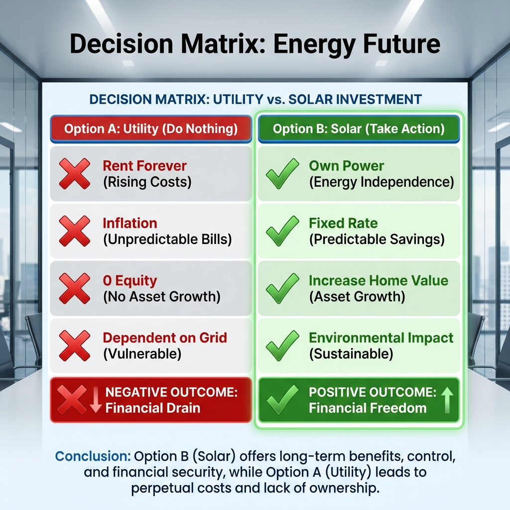

# Module 5: Closing with Confidence

## 🎥 Avatar Intro Script
**(Scene: Executive office or boardroom. Avatar is confident, professional, and reassuring.)**

"You've built rapport, explained the value, and handled the objections. Now, it's time to lead them to the finish line. Module 5 is about Closing with Confidence. Many salespeople freeze here, but not you. We'll learn the 'Assumptive Close'—where we act as if the decision is already made. We'll also use the 'Decision Matrix' to logically show that doing nothing is the most expensive option. It's time to get the ink."

*"The close is not something you do TO people; it's something you do FOR people."*

## 1. The Assumptive Close

Don't ask *if* they want to buy. Ask *how* they want to proceed.

*   **Weak**: "So, do you think you want to sign up?"
*   **Strong**: "So, looking at the calendar, I have appointments for the site survey on Tuesday at 2 PM or Wednesday at 10 AM. Which one works better for you to get the engineers out here?"

## 2. The Decision Matrix (Ben Franklin Close)

When they are on the fence, make it visual.

**Option A: Do Nothing (Utility)**
*   Risks: Rates go up ~5-10%/year.
*   Cost: 100% loss (Rent).
*   Equity: $0.
*   Control: None.

**Option B: Go Solar**
*   Risks: None (Performance Guarantee).
*   Cost: Less than current bill (Fixed).
*   Equity: Increases home value.
*   Control: 100%.

## 3. The Paperwork Walkthrough

Don't make it a contract. Make it "Getting approved".

*   "Okay, let's just get the basic info down to see if the roof qualifies for the incentives. It's just a soft credit check to see if we can get you that 30% coupon."

---

*(Chart comparing 'Sticking with Utility' (Risks/Costs) vs 'Going Solar' (Benefits/Equity))*
