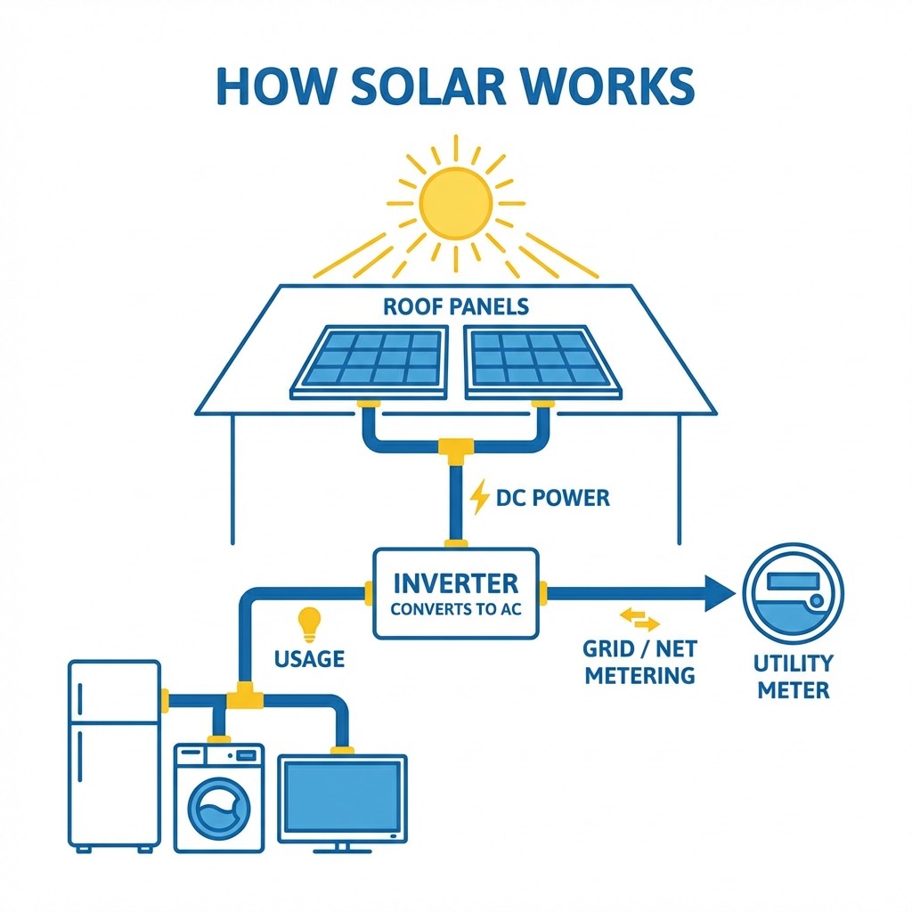

# Module 6: Solar Technical Mastery

## 🎥 Avatar Intro Script
**(Scene: Next to an installation diagram or holding a solar cell. Tech-savvy but accessible.)**

"You can't sell what you don't understand. But you also can't sell if you sound like an engineer. In Module 6, we're mastering the tech. I'll explain the difference between String Inverters and Micro-inverters so you can explain it to a 5-year-old. We'll also decode the confusing language of Utility Bills—Demand Charges, Time of Use, delivery fees. By the end of this module, you'll be the smartest person in the room, without sounding like a robot."

*"Confidence comes from competence. Know your product."*

## 1. How Solar Works (The 30-Second Explanation)

1.  **Sunlight hits panels** (DC Power).
2.  **Inverter converts it** (AC Power - what the home uses).
3.  **Home uses power first**.
4.  **Extra power goes to Grid** (Net Metering credits).
5.  **Night time**: You pull from the grid using your credits.

## 2. Inverters: The Heart of the System

*   **String Inverter**: Like Christmas lights. One goes out (shade), the whole string suffers. Cheaper, but less efficient in shade.
*   **Micro-inverters**: Each panel works independently. If one is shaded, the rest are fine. Safer, more efficient, longer warranty. (We prefer these!).

## 3. Decoding the Bill

*   **kWh (Kilowatt-hour)**: The amount of "fuel" you used. (What you pay for).
*   **kW (Kilowatt)**: The speed/size of the engine.
*   **Time of Use (TOU)**: Power is more expensive when demand is high (4pm-9pm). Solar helps avoid these peak rates.

---

*(Schematic: Sun -> Panels -> Inverter -> Home -> Grid)*
