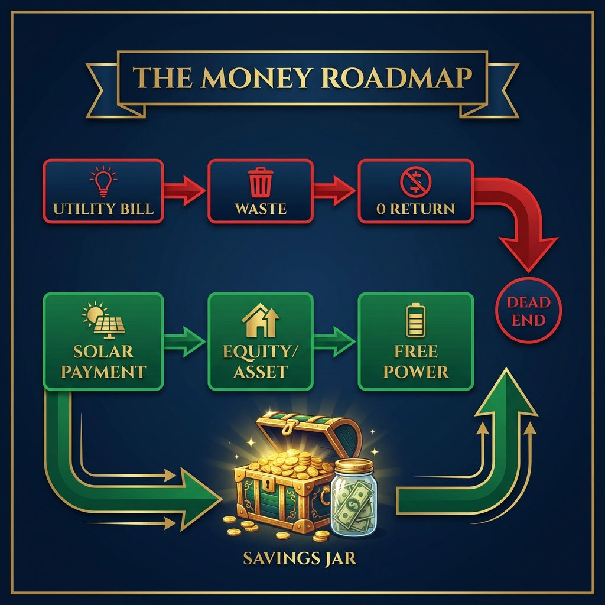

# Module 7: Mastering the Math (Financing & ROI)

## 🎥 Avatar Intro Script
**(Scene: Professional office with charts in the background. Serious but helpful tone.)**

"Solar is great for the planet, but let's be honest—homeowners buy it for their wallets. In Module 7, we're Mastering the Math. You need to become a financial consultant. I'll break down the Investment Tax Credit (ITC) so you don't sound like a tax accountant, but you still give them the value. We'll compare Cash vs. Loans vs. Leases, and I'll show you how to calculate the one number every homeowner cares about: Return on Investment."

*"Don't just sell the payment. Sell the financial freedom."*

## 1. The Investment Tax Credit (The Coupon)

Think of the 30% Federal Tax Credit as a "Coupon" from Uncle Sam to encourage renewable energy. 
*   **Simple Explanation**: "The government wants you to go solar so much they will pay for 30% of the system. But they don't send a check; they let you keep money you would have paid in taxes."

## 2. Cash vs. Loan vs. PPA/Lease

*   **Cash**: Best ROI. No interest. Asset ownership immediately.
*   **Loan**: $0 Down. Swap a high electric bill for a lower solar loan payment. Most popular.
*   **PPA/Lease**: "Pay for Power, not Panels". No debt, no maintenance, just cheaper power. Good for those who can't take the tax credit.

## 3. Return on Investment (ROI)

If a system costs $30,000 and saves $3,000/year, that’s a 10% tax-free return.
*   "Mr. Homeowner, where else can you get a guaranteed 10% return that is tax-free? The stock market? Real estate? This is the safest investment in your portfolio."

---

*(Chart showing money flow: Current Bill (Wasted $, Red) vs Solar Payment (Equity $, Green) -> Free Power)*
