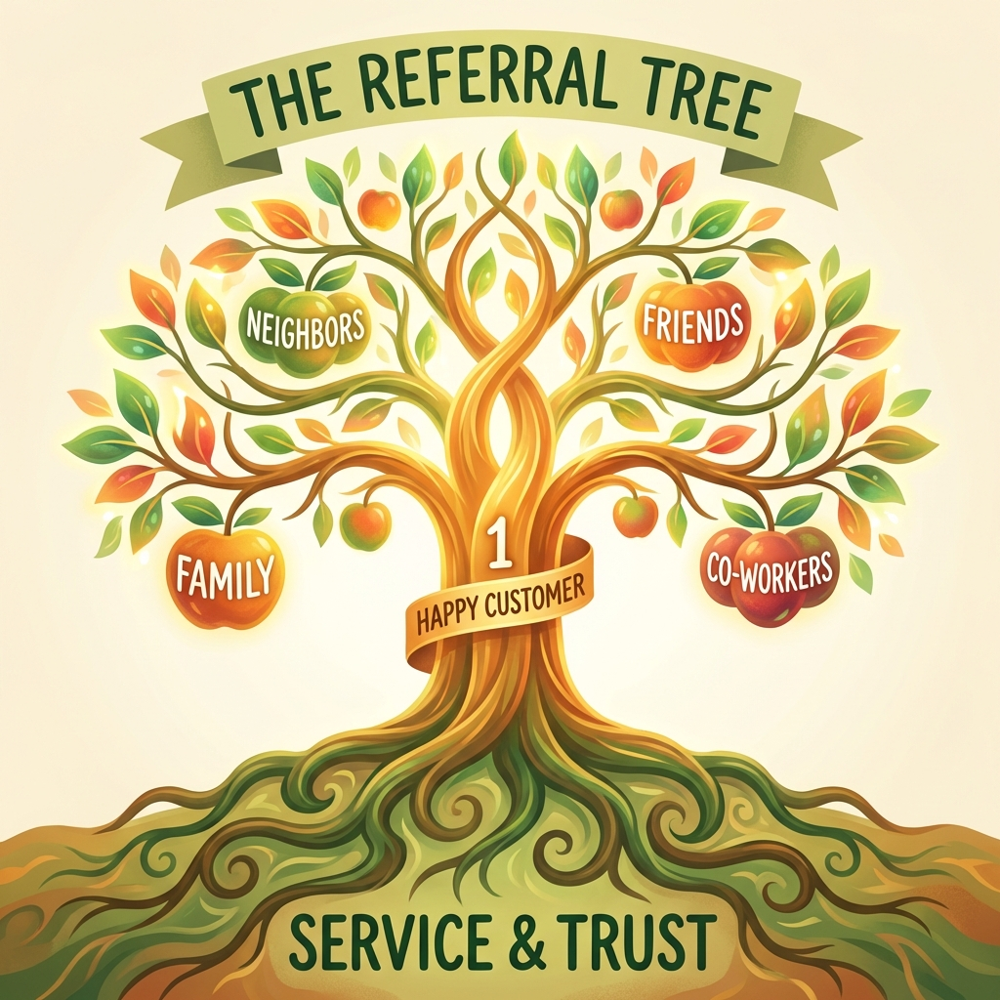

# Module 8: The Referral Engine

## 🎥 Avatar Intro Script
**(Scene: Relaxed outdoor setting or garden. Friendly and encouraging.)**

"The best salespeople don't hunt; they farm. If you're chasing new leads every day, you're working too hard. In Module 8, we're building 'The Referral Engine'. I'll show you the exact moment to ask for a referral (hint: it's not when you sign the contract). We'll also talk about 'Orphan Owners'—people who have solar but no agent—and how to turn them into your best source of business."

*"A sale is not the end. It's the beginning of a network."*

## 1. The Moment of Happiness

Don't ask for referrals when you ask for money. Ask when they are happiest.
*   **The Install Day**: They are excited to see the panels go up.
*   **The First Bill**: Seeing the $0 balance is the peak emotional moment.
*   **Script**: "Mr. Jones, now that you've killed your electric bill, who else do you know that is still complaining about high rates?"

## 2. Orphan Owner Campaigns

Thousands of people have solar from companies that went bankrupt. They feel abandoned.
*   **The Strategy**: Knock on doors with solar.
*   **Script**: "Hi, I saw you have solar. I'm not selling anything. I just know your original installer went out of business/left the area, and I wanted to drop off my card in case you ever need service or warranty help. By the way, how is the system running?"
*   *Result*: Instant trust. They will ask *you* questions.

## 3. The Referral Tree

One satisfied customer should branch out into 3 more.
*   The Neighbor (Curious about the install trucks).
*   The Relative (Heard about the savings at dinner).
*   The Co-worker (Saw the post on Facebook).

---

*(Infographic showing 1 Happy Customer (Trunk) branching into Neighbors, Friends, Family)*
