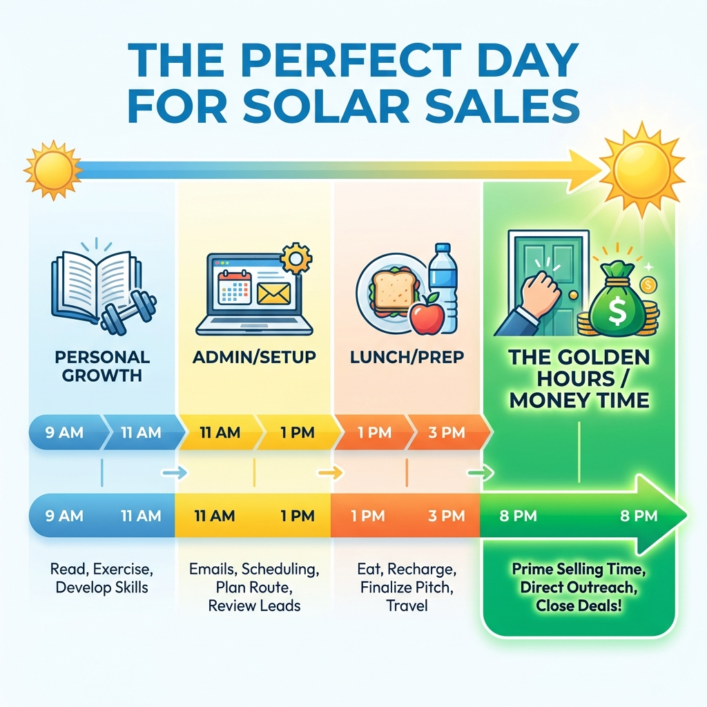

# Module 9: Territory Management & Canvassing

## 🎥 Avatar Intro Script
**(Scene: Map on the wall or a tablet displaying a route. Energetic and strategic.)**

"You can have the best script in the world, but if you're knocking the wrong doors at the wrong time, you're going to fail. Module 9 is about working smart. We're going to talk Territory Management. I'll teach you the 'Cloverleaf' pattern so you never waste gas driving back and forth. We'll also build 'The Perfect Day' schedule, so you know exactly what to do from the moment you wake up. Let's maximize your efficiency."

*"Amateurs work hard. Professionals work smart."*

## 1. The Cloverleaf Strategy

Don't drive aimlessly. Pick a center point (e.g., a current install or a new permit) and work in loops around it.
*   **Loop 1 (Immediate Neighbors)**: "Hey, we're working on Mrs. Jones's house..."
*   **Loop 2 (The Next Street)**: "We're going to be in the area..."
*   **Benefit**: You stay close to your social proof.

## 2. Digital Door Knocking

When it rains or gets dark, the work doesn't stop.
*   **Nextdoor/Facebook Groups**: "Hey neighbors, I'm the guy who helped the Smiths on Elm St go solar. If anyone has questions, I'm happy to help."
*   **Geofencing Ads**: Target ads to the specific neighborhood you are canvassing.

## 3. The Perfect Day Schedule

*   **9:00 AM - 11:00 AM**: Personal Development (Gym, Reading).
*   **11:00 AM - 1:00 PM**: Admin/Follow-up Calls (Don't knock yet, nobody is home).
*   **1:00 PM - 3:00 PM**: "Golden Hours" Prep / Lunch.
*   **3:00 PM - 7:30 PM**: **THE SHOWTIME**. Knocking doors. This is 90% of your income.

---

*(Timeline Infographic: Morning (Prep) -> Afternoon (Admin) -> Evening (Knocking/Money Time))*
