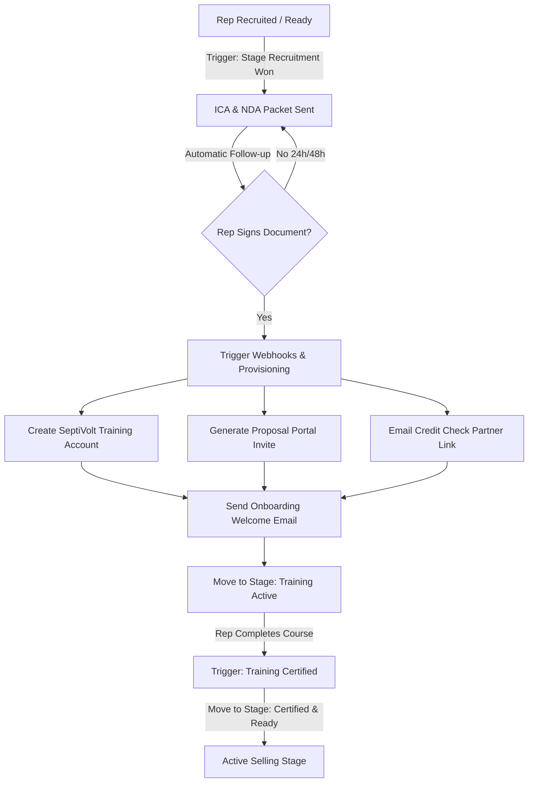

# GoHighLevel (GHL) Rep & Dealer Onboarding Automation Plan

This document outlines the step-by-step architecture to automate onboarding document signatures, provision training access via SeptiVolt, and setup proposal/credit check tools for newly hired sales representatives and dealers.

---

## 1. The Rep Onboarding Journey


---

## 2. GoHighLevel (GHL) Configuration Specs

### Pipeline: `Solar Rep Onboarding Pipeline`
| Stage | Trigger Criteria | Action Description |
| :--- | :--- | :--- |
| **1. Recruitment Won** | Deal marked "Won" or tag `sv-onboard-start` added | Initiate contract packet generation |
| **2. Signature Pending** | Contract packet generated and emailed | Start automatic SMS/Email follow-up flow |
| **3. Signed & Provisioning** | "Document Signed" webhook/event received | Run webhooks to SeptiVolt and tool APIs |
| **4. Training Active** | Credentials sent to Rep | Monitor SeptiVolt progress (Day 1 - Day 7) |
| **5. Certified & Ready** | SeptiVolt certification tag received | Send congrats, notify manager, unlock tools |
| **6. Active Seller** | First lead/proposal generated | Move out of onboarding into active CRM pipelines |

### GHL Custom Fields Required
*   `sv_rep_role`: (Dropdown: Sales Rep, Lead Setter, Manager, Dealer Owner)
*   `sv_onboarding_doc_link`: (URL)
*   `sv_onboarding_doc_status`: (Dropdown: Sent, Opened, Signed)
*   `sv_username`: (Text)
*   `sv_temp_password`: (Text)
*   `sv_proposal_invite_link`: (URL)
*   `sv_credit_portal_link`: (URL)

---

## 3. Automation Workflows (Triggers & Actions)

### Workflow 1: Onboarding Document Signature & Follow-up
*   **Trigger**: Contact pipeline stage updated to `Recruitment Won` OR Tag `sv-onboard-start` added.
*   **Immediate Actions**:
    1.  **Generate Agreement**: Trigger GHL native Documents/Contracts action using the **Independent Contractor Agreement (ICA)** template, or call DocuSign/Dropbox Sign via Webhook.
    2.  **Update Pipeline**: Move stage to `Signature Pending`.
    3.  **Deliver Packet**: Send `[CLAUDE_COPY_REQUIRED: Agreement Signature Request Email/SMS]` containing `{{contact.sv_onboarding_doc_link}}`.
*   **Wait**: 24 Hours
*   **Condition**: Has document been signed?
    *   **No**: Send `[CLAUDE_COPY_REQUIRED: Signature Reminder Email/SMS]`.
*   **Wait**: 48 Hours
*   **Condition**: Has document been signed?
    *   **No**: Send `[CLAUDE_COPY_REQUIRED: Final Warning Email]` and assign internal task to the manager.

### Workflow 2: Automated Provisioning & Tool Setup
*   **Trigger**: GHL native Document Signed trigger OR HelloSign/DocuSign Webhook.
*   **Immediate Actions**:
    1.  **Update Pipeline**: Move stage to `Signed & Provisioning`.
    2.  **Provision SeptiVolt Training Account**:
        *   **Action**: Webhook POST request to SeptiVolt Backend.
        *   **Endpoint**: `/api/v1/companies/{company_id}/members` (defined in [organization.py](file:///c:/Users/12132/Desktop/Antigravity%20Solar%20Sales%20Trainer%20Agent/backend/routers/organization.py#L806-L925) using [MemberCreateRequest](file:///c:/Users/12132/Desktop/Antigravity%20Solar%20Sales%20Trainer%20Agent/backend/routers/organization.py#L212-L218)).
        *   **Webhook Payload**:
            ```json
            {
              "username": "{{ contact.first_name | lower }}_{{ contact.last_name | lower }}_{{ contact.id }}",
              "email": "{{ contact.email }}",
              "role": "sales_rep",
              "language_preference": "{{ contact.language_preference | default('en') }}"
            }
            ```
        *   **Mapping API Response**: Map the returned `"temp_password"` and `"username"` from SeptiVolt's JSON response back into the contact's GHL custom fields (`{{ contact.sv_username }}` and `{{ contact.sv_temp_password }}`).
    3.  **Provision Proposal/Design Portal (Solo, Aurora, SolarGraf)**:
        *   **Action**: Webhook request to Zapier/Make.
        *   **Zap Action**: Create new user in Solo or Aurora under the company's organizational ID.
        *   *Fallback*: If the proposal engine does not support API creation, Zapier retrieves the company's static Rep Registration Link and updates `{{ contact.sv_proposal_invite_link }}`.
    4.  **Provision Credit Portal (Mosaic, GoodLeap, Sunlight Financial)**:
        *   **Action**: Populate `{{ contact.sv_credit_portal_link }}` with the dealer's unique GoodLeap Partner Registration URL.
    5.  **Deliver Credentials Packet**:
        *   Send `[CLAUDE_COPY_REQUIRED: Onboarding Welcome & Access Credentials Email]` containing:
            *   SeptiVolt Login: Url, `{{ contact.sv_username }}`, and `{{ contact.sv_temp_password }}`.
            *   Proposal Portal Login Link: `{{ contact.sv_proposal_invite_link }}`.
            *   Credit Check Portal Setup Link: `{{ contact.sv_credit_portal_link }}`.
        *   Update Pipeline Stage to `Training Active`.

### Workflow 3: Training Progress & Certification Unlock
*   **Trigger**: Webhook from SeptiVolt when a user earns their certification (or GHL API update when tag `sv-training-certified` is added by our sync script).
*   **Immediate Actions**:
    1.  **Update Pipeline**: Move stage to `Certified & Ready`.
    2.  **Notify Manager**: Send Internal Notification: "Rep {{contact.name}} has completed all Day 1-7 modules and passed the simulator checks. They are authorized to sell."
    3.  **Send Congratulatory Packet**: Send `[CLAUDE_COPY_REQUIRED: Certification Congratulatory Email]` containing their PDF certification badge and encouraging them to run their first proposal.

---

## 4. Copy Placeholder Manifest
The following placeholders require copywriting approval before going live:
*   `[CLAUDE_COPY_REQUIRED: Agreement Signature Request Email/SMS]`
*   `[CLAUDE_COPY_REQUIRED: Signature Reminder Email/SMS]`
*   `[CLAUDE_COPY_REQUIRED: Onboarding Welcome & Access Credentials Email]`
*   `[CLAUDE_COPY_REQUIRED: Certification Congratulatory Email]`

---

## 5. Technical Validation Checklist
- [ ] GHL API / OAuth integration is configured in SeptiVolt settings (see [integration_service.py](file:///c:/Users/12132/Desktop/Antigravity%20Solar%20Sales%20Trainer%20Agent/backend/services/integration_service.py#L91-L138)).
- [ ] Test the POST request payload to `/api/v1/companies/{company_id}/members` from GHL Webhook Action using a mock contact.
- [ ] Verify that the encryption key `INTEGRATION_ENCRYPTION_KEY` is present in the `.env` settings.
- [ ] Verify that Zapier/Make flow updates the GHL Custom Fields for `sv_username` and `sv_temp_password` correctly on webhook return.
